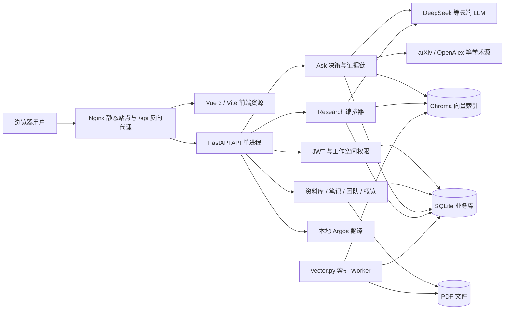
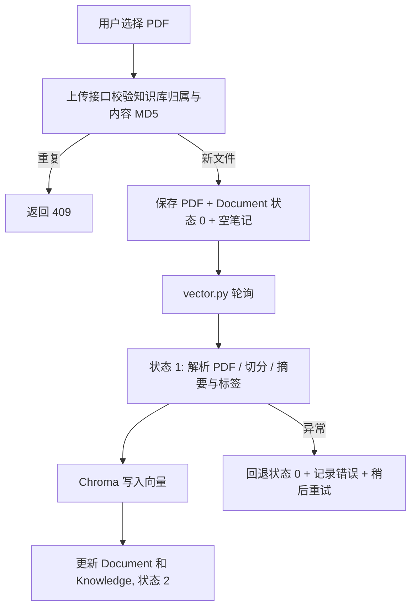
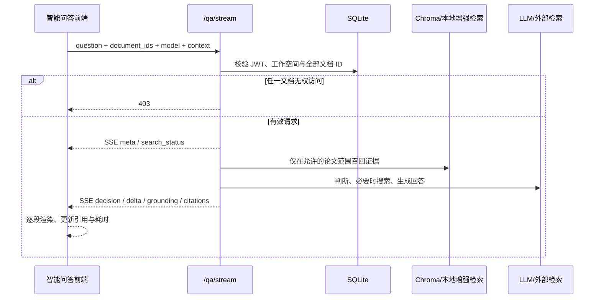
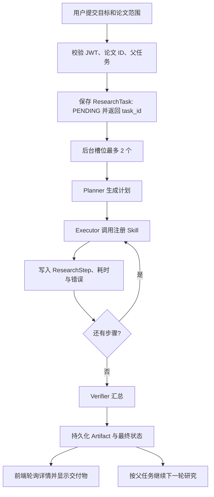
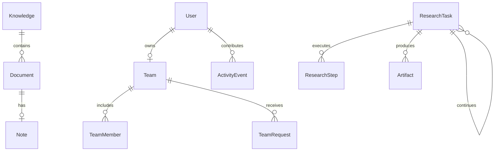

# PaperAgent 软件设计资料

更新日期：2026-09-30。本文依据当前实现，而非早期规划文档。图使用 Mermaid，GitHub 可直接渲染。代码入口为 `PaperQuery_Frontend/src/` 与 `PaperQuery_Backend/`。

## 1. 设计目标与总体架构

系统将论文原件、结构化业务数据与检索索引分开保存。前端负责资料选择、阅读器分栏、流式显示和操作反馈；API 负责鉴权、业务规则、问答/研究编排；独立 Worker 负责耗时的 PDF 索引任务。云端 LLM 和学术搜索是外部依赖，离线翻译模型与检索模型留在服务器本地。

### 1.1 目录与部署单元

| 单元 | 代码路径 | 核心责任 |
|---|---|---|
| SPA 路由/页面 | `PaperQuery_Frontend/src/router`, `src/views` | 登录、概览、论文库、阅读器、Ask、Research、团队 |
| 前端 API 层 | `PaperQuery_Frontend/src/api` | Axios 请求、SSE 消费、数据类型和回调 |
| API 启动 | `PaperQuery_Backend/main.py` | 建表/轻量迁移、模型预热、路由注册、组件初始化 |
| Router + CRUD | `core/backend/router`, `core/backend/crud` | 鉴权、业务操作、数据库访问 |
| 资料处理 | `vector.py`, `core/agent/dataprocessAgent.py` | 待处理文档轮询、解析/切分/入索引 |
| 检索/证据 | `core/vectordb`, `core/retrieval`, `core/decision`, `core/evidence` | 范围约束、候选召回、判断、引用/grounding |
| 研究 | `core/research`, `core/skills` | Planner、Executor、Verifier、Artifact 与八个注册技能 |
| 存储模型 | `core/backend/db/models.py` | SQLAlchemy 表定义 |

## 2. 主要模块设计

### 2.1 身份与工作空间

`/login` 签发 JWT，受保护 API 解析当前用户。`attach_workspace_lid` 根据管理员/成员关系决定工作空间：普通用户默认使用自己的 `lid`；团队成员使用所属团队的 `team_id`；团队管理员为团队 owner。资料库、PDF、笔记、研究与统计按 `workspace_lid` 过滤。团队重命名只修改 `Team.team_name`，不改变 `team_id`、成员关系或资料归属。

团队申请保存 `team_id` 与申请人；管理员可审批/拒绝，审批后写入 `TeamMember`。注册可按团队显示名或旧的管理员用户名申请。服务端 `/team/*` 每次验证管理员角色及 owner 关系。

### 2.2 资料库、PDF 与索引

`Knowledge` 是论文集合；`Document` 记录 PDF 元数据、处理状态、分类、标签、向量数；`Note` 按 `(lid, knowledgeID, uid)` 关联论文。上传到 `res/pdf/` 后记录 `documentStatus=0`；`vector.py` 轮询待处理记录，标为处理中，调用文档处理 Agent 建索引，更新元数据与知识库计数，最后标记完成。处理异常会回退排队状态，并记录日志供排障。临时论文存放在 `TMPDocument` 和 `res/tmppdf/`，服务于会话内问答。

### 2.3 检索与可信问答

`POST /qa/stream` 接收问题、模型与 `document_ids`。先查 `Document`/`TMPDocument` 并确认每个 ID 属于当前工作空间；之后才构造文档范围过滤。一般对话可不指定论文。所选论文问答走 Chroma 证据检索，必要时使用 BM25 + BGE-M3 + CrossEncoder 增强；模型缺失时回退到 ONNX/Chroma。决策层对意图和证据充分性进行判断，低证据时拒答或触发外部学术搜索；生成答案后做 grounding 检查，并向前端发送 SSE 事件。外部搜索结果仅表示检索到的元数据，不能当作已读 PDF 的全文证据。

SSE 使用 `meta`、`decision`、`search_status`、`external_papers`、`delta`、`grounding`、`citations` 等事件。Nginx 必须关闭代理缓冲，否则“流式”会在客户端表现为整段突现。引用包含文档 ID、知识库 ID、页码和片段 ID，用于回到 PDF 页面核查。

### 2.4 阅读器、离线翻译与笔记

前端阅读器以横向可拖动面板放置 PDF 和助手，助手内部以纵向可拖动面板放置翻译/笔记与问答。PDF 渲染在自身容器内，`ResizeObserver` 适配容器宽度；缩放状态只影响 PDF 页，支持按钮及 Ctrl+滚轮。选中文本延迟 250 ms 提交 `/translate`，后端用已安装 Argos 英中包分块翻译，最长 12000 字符；翻译不发送到云端。

笔记保存到 `Note`，笔记集经 `Note + Document + Knowledge` 关联查询，仅展示非空笔记，并提供删除与跳转。阅读时长由前端定时提交 `/dashboard/reading`，后端用 `ActivityEvent` 汇总今日数据。

### 2.5 Research 任务编排

任务创建接口校验所选文档归属及可选的父任务归属，然后持久化 `ResearchTask(PENDING)`，把执行任务交给进程内 BackgroundTasks。执行时最多两个研究槽位，Planner 生成计划，Executor 顺序运行注册技能，Verifier 检查结果，步骤写入 `ResearchStep`，交付物写入 `Artifact`。LLM 流式 token 心跳会更新任务时间；前端通过任务列表/详情轮询显示进度与耗时。继续研究时读取父任务部分交付物摘要，构成下一轮目标上下文。

目前任务在 API 进程内，不具备跨进程持久队列的自动接管能力。部署时使用一个 API worker，并避免在长任务运行中重启。失败任务保留错误与已写入步骤，研究成果需要人工核验来源。

## 3. 数据设计

这些关联在应用层通常通过 `lid`、`knowledgeID`、`uid`、`task_id` 组合实现，不能仅凭上图推断数据库都设置了外键。`lid` 是隔离的关键字段；团队 `team_id` 与管理员 `lid` 复用。SQLite 存业务记录；Chroma 存向量；PDF 原件和任务沙箱文件位于 `res/` 下。三者备份/恢复应保持一致。

## 4. 关键接口

| 分组 | 代表接口 | 说明 |
|---|---|---|
| 账号 | `POST /register`, `POST /login`, `GET /user/me` | 注册、登录、当前身份 |
| 团队 | `GET /team/info`, `POST /team/rename`, `/team/requests`, `/team/approve`, `/team/reject`, `/team/remove` | 管理员操作 |
| 论文 | `/knowledges/*`, `/document/upload`, `/document/Info`, `/document/getFile`, `/document/delete` | 库/文档生命周期 |
| 笔记与概览 | `/note/*`, `/notes/collection`, `/dashboard/overview`, `/dashboard/reading` | 笔记、统计与阅读脉冲 |
| 问答/翻译 | `POST /qa/stream`, `POST /translate` | SSE 问答与本地英中翻译 |
| 研究 | `POST /research/tasks`, `GET /research/tasks`, `GET /research/tasks/{task_id}` | 创建与查询任务 |
| 运行状态 | `/health/live`, `/health/ready` | 存活与本地依赖检查 |

FastAPI 运行后可通过 `/docs` 查看实际 OpenAPI。部分旧版 `/chat/*` 路由为兼容接口；论坛 `/forum/*` API 仍注册，但网页路由未开放。

## 5. 关键参数与运行约束

| 参数 | 当前默认/限制 | 作用与说明 |
|---|---:|---|
| `MAX_UPLOAD_MB` | 50（`.env.example`） | PDF 上传/导入上限；Nginx `client_max_body_size` 须同步 |
| `/translate` 输入长度 | 12000 字符 | 超限返回 413；本地模型按约 1200 字符切块 |
| PDF 缩放 | 50%–250%，步长 10% | 仅缩放论文页，不改变外层分栏尺寸 |
| 阅读脉冲 | 页面约每 15 秒；单次 1–60 秒 | 仅窗口可见且聚焦时计入；API 限制单次值 |
| Research 并发槽 | 2 | `_research_slots` 进程内信号量；多 worker 时不会全局共享 |
| `RESEARCH_MAX_STEPS` | 12 | 研究规划/执行的步骤数配置上限 |
| `RESEARCH_MAX_RETRIES` | 2 | 研究错误重试配置，具体行为由编排器决定 |
| `SKILL_DEFAULT_TIMEOUT` | 120 秒 | 单技能默认时限；LLM token 心跳另行记录任务活动 |
| `DENSE_K` / `SPARSE_K` | 20 / 20 | V2 检索配置；当前本地增强检索还使用调用方的 `k` 决定实际候选数 |
| `RRF_C` / `RERANK_CANDIDATES` / `FINAL_K` | 60 / 24 / 8 | V2 检索默认配置；以实际接入的检索实现为准 |
| `EVIDENCE_THRESHOLD` | 0.65 | 证据判断默认阈值配置 |
| `FRONTEND_ORIGINS` | 本地 8080 两个来源 | 跨域部署时配置精确域名；同源 `/api` 代理更简单 |
| `ACCESS_TOKEN_EXPIRE_MINUTES` | 1440 | JWT 有效期；更改后旧 token 的验证取决于签名密钥 |

参数并非全部都直接决定当前混合检索排序：`LocalRetrievalEnhancer` 目前按调用方 `k` 取候选，BGE-M3 对候选重评分，再对最多 4 条执行 CrossEncoder；不要把配置表直接理解为线上固定 Top-K 性能承诺。模型文件是否存在由启动时检查，健康接口的 `hybrid_retrieval` 字段反映是否启用增强器。

## 6. 安全与可用性边界

- 上传、取文件、问答所选文档和研究所选文档都应在 API 层按工作空间校验；JWT 和团队角色检查不依赖前端展示。
- 外部 PDF 直导仅允许经过检查的 arXiv HTTPS PDF 地址与受限重定向，避免任意 URL 下载。
- `.env`、生产 SQLite、论文原件、Chroma 索引和大型模型不应进入公开 Git 历史。
- SQLite 与进程内研究执行适用于单机、小规模协作；需要高并发/多副本时应单独设计数据库迁移、任务队列和共享存储。
- 现有自动化测试覆盖主要 API 行为，但浏览器交互、真实云端质量、新服务器安装需要逐项人工验收；详见 [功能验证记录](功能验证记录.md)。
